<!--  -->

# MeetingMind

**AI-powered meeting assistant that listens, questions, and summarizes — running on iPhone with swappable cloud and on-device providers.**


---

<!--  -->
<!--  -->
<!--  -->
<!--  -->

## What It Does

- **Records audio and transcribes in real-time** — see words appear as they're spoken, with cloud (Whisper) or on-device (SpeechAnalyzer) transcription.
- **Generates intelligent questions while the speaker is still talking** — every ~50 words, AI surfaces contradictions, missing data, risks, or logical gaps.
- **Produces a structured meeting summary** — key points, action items, and detected participants, generated automatically when recording stops.
- **Chat with AI about the meeting afterwards** — ask follow-up questions with the full transcript as context.
- **Works with 4 provider combinations** — cloud, on-device, or hybrid. Mix and match transcription and AI providers to balance quality, privacy, and cost.
- **Zero-config on capable devices** — on iPhone 15 Pro and newer with Apple Intelligence enabled, MeetingMind auto-selects on-device providers on first launch. No API keys, no setup — just tap record.

## Architecture

MeetingMind uses a protocol-oriented design where transcription and AI are abstracted behind swappable providers. The `SessionManager` orchestrates the full pipeline and handles automatic fallback from on-device to cloud providers.

```mermaid
graph LR
    A[🎤 AudioManager] -->|PCM Audio| B{TranscriptionProvider}
    B -->|WhisperProvider| C[OpenAI Whisper API]
    B -->|SpeechAnalyzerProvider| D[On-Device SpeechAnalyzer]
    B -->|Transcript| E{AIProvider}
    E -->|ClaudeProvider| F[Anthropic Claude API]
    E -->|FoundationProvider| G[On-Device Apple Intelligence]
    E -->|Summary + Questions| H[📱 SwiftUI Views]
```



### Provider Combinations

|  | **Cloud AI** (Claude) | **On-Device AI** (Foundation Models) |
|---|---|---|
| **Cloud Transcription** (Whisper) | Full cloud | Hybrid |
| **On-Device Transcription** (SpeechAnalyzer) | Hybrid | Fully offline |

All four combinations are implemented and selectable from the Settings tab. On-device providers automatically fall back to cloud if they encounter errors. On first launch, the app detects hardware capabilities and auto-selects the best available providers.

### Core Protocols

```swift
// Transcription — chunk-based or streaming
protocol TranscriptionProvider: Sendable {
    func transcribe(audioData: Data, prompt: String?) async throws -> String
}

protocol StreamingTranscriptionProvider: TranscriptionProvider {
    func startStreaming(audioBuffers: AsyncStream<AVAudioPCMBuffer>,
                        audioFormat: AVAudioFormat) -> AsyncStream<TranscriptUpdate>
}

// AI — questions, summaries, and chat
protocol AIProvider: Sendable {
    func generateQuestion(context: String, previousQuestions: [String]) async throws -> String?
    func generateSummary(transcript: String) async throws -> SummaryData
    func chat(message: String, transcript: String,
              history: [(role: String, content: String)]) async throws -> String
}
```

## Requirements

- **iPhone 15 Pro or newer** (A17 Pro chip required for on-device AI)
- **iOS 26+**
- **Xcode 26+**
- **For cloud providers:** OpenAI API key (Whisper) and/or Anthropic API key (Claude)
- **For on-device providers:** Apple Intelligence must be enabled in Settings > Apple Intelligence & Siri

## Quick Start

```bash
git clone https://github.com/richlira/MeetingMind.git
cd MeetingMind
open MeetingMind.xcodeproj
```

1. Open in **Xcode 26+**
2. Select your physical device as the run destination
3. Build and run (`Cmd + R`)
4. **On iPhone 15 Pro+** with Apple Intelligence enabled: tap record immediately — on-device providers are auto-selected
5. **On older devices** or for cloud providers: go to **Settings** and enter your API keys ([OpenAI](https://platform.openai.com/api-keys) / [Anthropic](https://console.anthropic.com/settings/keys))
6. Tap the record button and start talking

> **Note:** On-device AI (Foundation Models) requires a physical device with A17 Pro chip or newer — it does not work in the simulator. The app detects the simulated device model and correctly hides on-device options for unsupported hardware.

## Project Structure

```
MeetingMind/
├── MeetingMindApp.swift              # App entry point, smart defaults, fallback validation
├── Info.plist                        # Microphone & speech recognition permissions
├── Config/
│   └── ProviderConfig.swift          # Factory methods for creating providers
├── Core/
│   ├── AI/
│   │   ├── AIProvider.swift          # AI protocol definition
│   │   ├── ClaudeProvider.swift      # Anthropic Claude API (cloud)
│   │   └── FoundationProvider.swift  # Apple Intelligence (on-device)
│   ├── Audio/
│   │   └── AudioManager.swift        # AVAudioEngine recording + chunk management
│   ├── Pipeline/
│   │   └── SessionManager.swift      # Orchestrator: audio → transcription → AI
│   └── Transcription/
│       ├── TranscriptionProvider.swift    # Transcription protocol definitions
│       ├── WhisperProvider.swift          # OpenAI Whisper API (cloud)
│       └── SpeechAnalyzerProvider.swift   # Apple SpeechAnalyzer (on-device)
├── Models/
│   ├── Session.swift                 # Meeting session (SwiftData)
│   ├── TranscriptSegment.swift       # Individual transcript chunks (SwiftData)
│   ├── Question.swift                # AI-generated questions (SwiftData)
│   ├── ChatMessage.swift             # Post-meeting chat messages (SwiftData)
│   └── SummaryData.swift             # Codable struct for AI summary response
├── Navigation/
│   └── NavigationRouter.swift        # Cross-tab navigation coordinator
├── Utilities/
│   ├── DeviceCapability.swift        # Hardware detection + on-device capability checks
│   ├── KeychainManager.swift         # Secure API key storage
│   └── ProviderSelection.swift       # UserDefaults-backed provider preferences
└── Views/
    ├── MainTabView.swift             # Root tab bar (Record, History, Settings)
    ├── Recording/
    │   └── RecordingView.swift       # Live recording, adaptive welcome screen
    ├── History/
    │   └── SessionListView.swift     # Past sessions list with swipe-to-delete
    ├── Review/
    │   ├── SessionDetailView.swift   # Session detail with segmented tabs
    │   ├── SummaryView.swift         # AI summary, key points, action items
    │   ├── TranscriptView.swift      # Full transcript with timestamped segments
    │   └── ChatView.swift            # Post-meeting AI chat interface
    └── Settings/
        └── SettingsView.swift        # Providers, API keys, security info, about
```

## How to Add a New Provider

The protocol-oriented architecture makes it straightforward to add new providers. For example, you could add Google Gemini, local Whisper via WhisperKit, or any other service.

### Adding a Transcription Provider

1. Create a new file in `Core/Transcription/`:

```swift
struct MyTranscriptionProvider: TranscriptionProvider {
    func transcribe(audioData: Data, prompt: String?) async throws -> String {
        // Send audioData (16-bit PCM WAV) to your service
        // Return the transcribed text
    }
}
```

For streaming providers, conform to `StreamingTranscriptionProvider` instead and implement `startStreaming(audioBuffers:audioFormat:)`.

2. Add a case to `TranscriptionProviderType` in `Utilities/ProviderSelection.swift`
3. Add the factory logic in `Config/ProviderConfig.swift`
4. Add a picker option in `Views/Settings/SettingsView.swift`

### Adding an AI Provider

1. Create a new file in `Core/AI/`:

```swift
struct MyAIProvider: AIProvider {
    func generateQuestion(context: String, previousQuestions: [String]) async throws -> String? {
        // Return a question or nil if nothing interesting to ask
    }

    func generateSummary(transcript: String) async throws -> SummaryData {
        // Return structured summary with key points, action items, participants
    }

    func chat(message: String, transcript: String,
              history: [(role: String, content: String)]) async throws -> String {
        // Return AI response using transcript as context
    }
}
```

2. Add a case to `AIProviderType` in `Utilities/ProviderSelection.swift`
3. Add the factory logic in `Config/ProviderConfig.swift`
4. Add a picker option in `Views/Settings/SettingsView.swift`

## Tech Stack

| Layer | Technology |
|---|---|
| Language | Swift 6, Swift Concurrency (async/await, AsyncStream) |
| UI | SwiftUI |
| Persistence | SwiftData |
| Audio Capture | AVFoundation (AVAudioEngine) |
| Cloud Transcription | OpenAI Whisper API (direct URLSession) |
| Cloud AI | Anthropic Claude API (direct URLSession) |
| On-Device Transcription | SpeechAnalyzer framework (iOS 26) |
| On-Device AI | Foundation Models framework (iOS 26) |
| Security | iOS Keychain (SecItem API) |

**Zero third-party dependencies** — pure Apple frameworks + direct REST API calls. No SDKs, no CocoaPods, no SPM packages.

## Privacy

- **Audio stays on device** — only transcribed text is sent to cloud providers (never raw audio beyond Whisper's transcription endpoint)
- **On-device mode: zero data leaves the device** — transcription and AI run entirely locally
- **API keys stored in Keychain** — encrypted with `kSecAttrAccessibleWhenUnlockedThisDeviceOnly`, auto-cleared on app reinstall
- **No backend, no analytics, no tracking** — the app talks directly to provider APIs
- **No accounts or sign-up required**

## Roadmap

- [ ] Speaker diarization (who said what)
- [ ] WhisperKit integration (on-device Whisper, no API needed)
- [ ] Export to Notion / Google Docs
- [ ] Apple Watch companion app
- [ ] Siri / Shortcuts integration
- [ ] Multi-language simultaneous detection
- [ ] Shared sessions (multiple devices in same meeting)
- [ ] Custom prompt templates for different meeting types
- [ ] Audio playback synced with transcript segments

## Contributing

Contributions are welcome! Here's how to get started:

1. Fork the repository
2. Create a feature branch (`git checkout -b feature/amazing-feature`)
3. Commit your changes (`git commit -m 'Add amazing feature'`)
4. Push to the branch (`git push origin feature/amazing-feature`)
5. Open a Pull Request

### Guidelines

- Follow existing code conventions and project structure
- Use Swift Concurrency (`async`/`await`, `AsyncStream`) — no completion handlers
- No force unwraps (`!`) — use `guard let` or `if let`
- No third-party dependencies unless absolutely necessary
- Test on a physical device for on-device provider changes
- Keep providers stateless where possible (structs over classes)

See [open issues](https://github.com/richlira/MeetingMind/issues) for ideas on what to work on.

## License

This project is licensed under the MIT License — see the [LICENSE](LICENSE) file for details.

## Author

Built by **Rich** — Senior Software Engineer & AI Full Stack Engineer

Claude Community Meetup organizer, Mexico City (600+ members)

[](https://github.com/richlira)
[](https://x.com/richlira)
[](https://linkedin.com/in/richlira)
